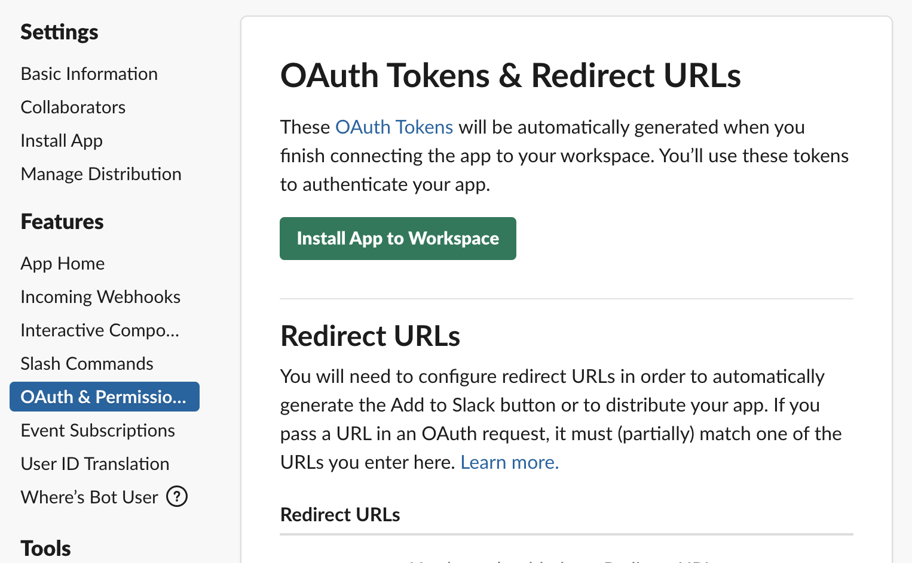

# 第四回
## 概要
今までで学習したGolangの使い方を踏まえてSlackBotを作ってみる。

## 準備
1. まずはSackBot用のgoのpackageを入れる。
```sh
$ go get -u github.com/slack-go/slack
```
（`-u`:update、既に入っている場合アップデートする。）

2. もしも入会していなければ
[ここ](https://slack.com/intl/ja-jp/get-started#/create)でワークスペース作ってください...。

**（もしくは入会）**
3. SlackAppの作成
   1. [Slack Appの作成](https://api.slack.com/apps?new_classic_app=1)に飛ぶ
   2. 次の図を参考に入力
   
   3. Bots選択
   
   4. Add Legacy Bot Userを選択
   
   5. 必要事項を記入してAdd
   - 今回Display Nameは`Webservice2020_YOUR_NAME`にしましょう。
   6. `OAuth & Permissions`から`Install App to Workspace`選択
   
   7. 内容を確認したら`許可する`押しましょう。
   8. `OAuth & Permissions`に戻ると表示される、`xoxb-`から始まる`Bot User OAuth Access Token`を後に使います。

## 仕組み
### main package
#### main関数
```go
func main(){
	var api *slack.Client = slack.New(BotToken)//1

	RTM = api.NewRTM()//2

	go RTM.ManageConnection()//3

	for msg := range RTM.IncomingEvents {
		switch ev := msg.Data.(type) {
		case *slack.ConnectedEvent:
			fmt.Printf("Start connection with Slack\n")//4
		case *slack.MessageEvent:
			EV = ev
			ListenTo()//5
		}
    }
}
```

1. Botトークンをもとに、Slackとの通信をするための初期化をする
2. Real Time Messangerを作成。これで各種Slackとの通信を行う。
3. 通信を開始する。
4. Slackとの通信を開始したらメッセージを表示
5. メッセージが送信されたらListenTo関数を実行する。

#### ListenTo関数

```go
//ListenTo excute functions under suitable conditions
func ListenTo() {
	switch {
	case strings.Contains(EV.Text, "こんにちは")://1
		RTM.SendMessage(RTM.NewOutgoingMessage(EV.Channel, "こんにちは。"))//2
		return
	}
}

```

1. メッセージに"こんにちは"という文字が含まれていれば`NameCheck`関数を実行する
2. `こんにちは。`と返す。