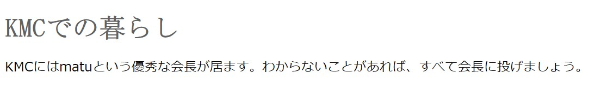

## CSS
とりあえずHTMLの作成はできるようになりましたが、このままではデザインが素朴(ってかダサい)。というわけで、最低限、色付けたり出来るようになりましょう！

### 基本
```html
<!DOCTYPE html>
<html lang="ja">

<head>
    <meta charset="UTF-8">
    <link rel="author" href="mailto:someone@example.jp">
    <title lang="jp">WebService2020</title>
        <style>
            h1 {
                font-family: "ＭＳ 明朝", serif;
                color: #616161;
            }
        </style>

<body>
    <h1>KMCでの暮らし</h1>
    <p>KMCにはmatuという優秀な会長が居ます。わからないことがあれば、すべて会長に投げましょう。</p>
</body>
</html>
```
**実行例**


CSSはこのようにhead内にStyleタグの要素として記述していくことでも記述することが出来ます。では、ひとつずつ要素を眺めていきましょう。

## 各要素の名前
CSSの文法はおおまかに次の塊の集合であらわされる。
```css
セレクタ {
    プロパティ: 値;
}
```

## セレクタ

|種別|セレクタ|選択される要素|
| ---- | ---- | ---- |
|要素型セレクタ|タグ|タグの要素|
|全称セレクタ|*|すべての要素|
|classセレクタ|要素名.クラス名|該当するクラスに属する要素|
|idセレクタ|要素名#id名|該当する要素|
|/2. 疑似クラス|要素名:link|未訪問のリンク|
|要素名:visited|訪問済のリンク|

## よく使うプロパティ


```html
<!DOCTYPE html>
<html lang="ja">
    <head>
        <meta charset="UTF-8">
        <link rel="author" href="mailto:someone@example.jp">
        <title lang="jp">WebService2020</title> 
        <link href="https://fonts.googleapis.com/css2?family=M+PLUS+1p:wght@500;700&display=swap" rel="stylesheet">
        <style>
            .sample {                
                font-family: 'M PLUS 1p', sans-serif;
            }
            h1.sample {
                font-weight: 700;
            }
            p.sample {
                font-weight: 500; 
            }
        </style>
    </head>
    <body>
        <h1 class="sample">KMCでの暮らし</h1>
        <p class="sample">KMCにはmatuという優秀な会長が居ます。わからないことがあれば、すべて会長に投げましょう。</p>
    </body>
</html>
```