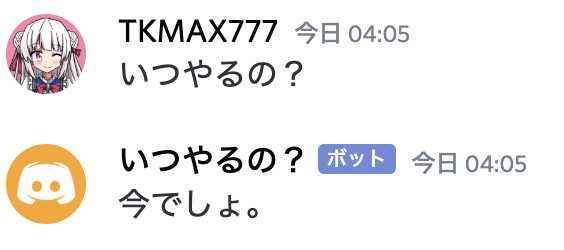

# Discord: Wikipedia Random Bot
## 概要
　「いつやるの？」に「今でしょ」を返す。
## 使い方
### 準備
　discordgo の導入
```sh
$ go get github.com/bwmarrin/discordgo
```
　credit.jsonの準備
credit.jsonを作成し、
```json
{
    "discord": "Bot TOKEN"
}
```
### 動作
- こんな感じの挙動

