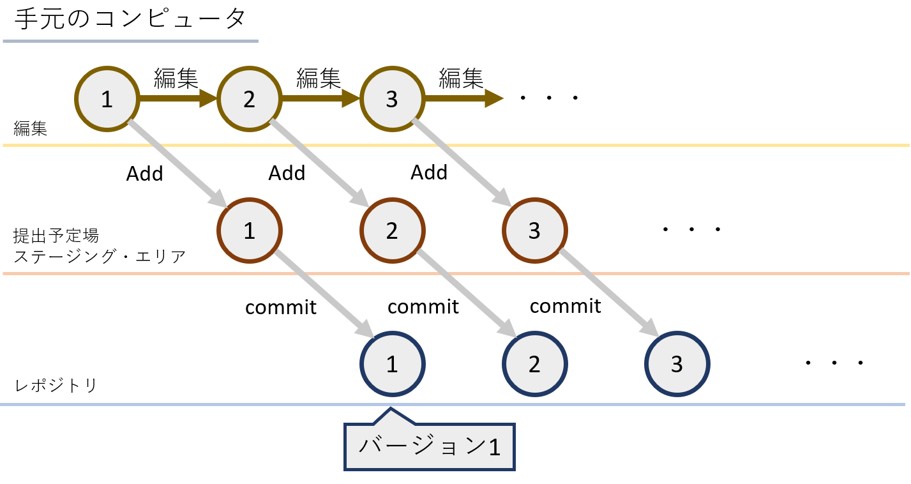

# Gitの使い方   
## 目次
<!-- TOC -->

- [Gitの使い方](#gitの使い方)
    - [目次](#目次)
    - [概要](#概要)
    - [バージョン管理システム(VersionControlSystem, VCS)について](#バージョン管理システムversioncontrolsystem-vcsについて)
    - [開発の流れ](#開発の流れ)
        - [概略](#概略)
        - [開発を始める](#開発を始める)
        - [修正したファイルの登録](#修正したファイルの登録)
        - [ファイルの削除](#ファイルの削除)
        - [バージョンを遡る](#バージョンを遡る)

<!-- /TOC -->
## 概要
WebServiceを含めたプログラムの開発に便利なGit, GitHubの使いかたを学びます。

## バージョン管理システム(VersionControlSystem, VCS)について
過去の状態に復元できるようにするためにデータの差分を保存することで、問題が発生したときにどの段階でそれが生じたのかを調べたり、書いているときにぐちゃぐちゃになってしまったときに戻せるようにすることを可能にするシステムのことです。Gitはこのシステムの内の一つです。


## 開発の流れ
### 概略

では、まず大まかにどのように管理していくのかを見ていきましょう。



１番上の編集と銘打った黄色の線が手元で編集している場です。ここの
**修正済**
の内容を
**ステージング・エリア**
(
**インデックス**
)と呼ばれる黄赤色で引いた線上の提出予定場に
**Add**
していきます。その後、このステージング・エリアに登録した
**ステージ済**
の内容を今青色で引いた線上の
**レポジトリ**
にコミットしていくことで、バージョン情報を記録していきます。


### 開発を始める
1. まずは次のコマンドで適当なディレクトリを作成します。

```sh
$ cd         #ホームディレクトリに移動
$ mkdir EX   #EXという名のディレクトリを作成
```

一応VSCodeでそのディレクトリを開いておくと良いかもしれません。このディレクトリが先程の黄色の編集線に該当します。

2. Gitレポジトリとして、そのディレクトリを登録します。

```sh
$ git init
```
これにより、そのディレクトリに`.git`というサブディレクトリが作成されその内部にバージョン情報を格納していきます。(基本的にユーザがこのディレクトリに触れることはありません。中身が気になる場合は
[ここ](https://git-scm.com/book/ja/v2/ch00/ch10-git-internals)を参照すれば書いてあります。)

これで先程の青線のレポジトリが用意されました。

3. 適当なファイルを作成してみましょう。

```sh
$ echo 例1 >> example.txt #example.txtに"例1"という文字列を追記
$ cat example.txt         #example.txtの中身を出力
例1
```

試しにVSCodeで確認しても"例1"という文字列が格納されたことがわかりますね。

ここでGitの状態を確認してましょう。

```sh
$ git status     #git状態を確認する
On branch master

No commits yet

Untracked files:
  (use "git add <file>..." to include in what will be committed)
        example.txt

nothing added to commit but untracked files present (use "git add" to track)

```

まだ監視対象になっていないので、`example.txt`がUntracked filesに分類されていることがわかります。

4. このファイルをGitのバージョン情報の監視対象にしてみましょう。

```sh
$ git add example.txt    #git のステージング・エリアに登録する
```

これで、先程の黄赤色のステージング・エリアに`example.txt`を登録することができました。

ここでも試しに状態を確認してみると、
```sh
$ git status
On branch master

No commits yet

Changes to be committed:
  (use "git rm --cached <file>..." to unstage)
        new file:   example.txt

```

となり、Changed to be committed(これからコミットされる予定にあるもの)に分類されていることがわかります。

5. ではコミットすることで、バージョン登録してみましょう。

```sh
$ git commit -m "Example Text" 
```

このコマンドでいまステージング・エリアにあるファイルを"Example Text"というコメントを付けてコミットすることが出来ます。このコメントは後にバージョンを遡る時のヒントとなるので、このコミットによってどのような変更をしたかを把握できる完結なコメントを残すようにこころがけましょう。

ここまでで、新しいファイルをステージング・エリアに登録し、その後コミットすることでバージョン履歴を更新するところまで出来るようになりました。

### 修正したファイルの登録

では次に、監視対象になっているファイルを編集しコミットしてみましょう。基本的には先程と同じ流れになります。

1. `example.txt`の編集

```sh
$ echo \例2 >> example.txt   #example.txtに改行を挟んだのち"例2"と追記
$ cat example.txt             #example.txtの内容を出力
例1
例2
```

このコマンドによって、`example.txt`に"例2"と追記しました

この状態でgitの状態を確認してみましょう。

```sh
$ git status
On branch master
Changes not staged for commit:
  (use "git add <file>..." to update what will be committed)
  (use "git restore <file>..." to discard changes in working directory)
        modified:   example.txt

no changes added to commit (use "git add" and/or "git commit -a")
```

not stagedかつmodifiedに分類されている様子が観察されますね。

2. ステージング・エリアに追加してみましょう。

先程と同じ`git add`コマンドで登録できます。
```sh
$ git add example.txt

```

同じく確認します。

```sh
$ git status
On branch master
Changes to be committed:
  (use "git restore --staged <file>..." to unstage)
        modified:   example.txt

```

分類が`Changes not staged for commit:`から`Changes to be committed:`にかわったことが観察されますね。

あとは同じく

```sh
$ git commit
```
コマンドでコミットすることができるのですが、ここでは試しにここでもう一度ファイルを編集してみましょう。

```sh
$ echo \例3 >> example.txt   #example.txtに改行を挟んだのち"例3"と追記
$ cat example.txt  
例1
例2
例3  
```

さて、ではここで状態を確認してみましょう。

```sh
$ git status
On branch master
Changes to be committed:
  (use "git restore --staged <file>..." to unstage)
        modified:   example.txt

Changes not staged for commit:
  (use "git add <file>..." to update what will be committed)
  (use "git restore <file>..." to discard changes in working directory)
        modified:   example.txt

```

同一ファイルが`Changes to be committed`かつ、`Changes not staged for commit`に分類されていますね。ステージング・エリアに登録されているファイルは先程addしたファイルで修正済みエリアにあるファイルは今修正したものになっています。よってこの状態でコミットした場合、そのまま以前ステージング・エリアに登録したファイルでバージョン登録され、`git add`した場合、今編集したファイルがコミットされます。

### ファイルの削除
では、反対にファイルの削除はどのように行うのかが疑問にあがるとおもいます。それは次のコマンドで行うことが出来ます。

```sh
$ git rm ファイル名
```

試してみましょう。

```sh
$ touch example2.txt   #example2.txtの作成
$ ls                   #このディレクトリの内容を表示
example.txt  example2.txt
```

あたらしく`example2.txt`を作成しました。これをまずはコミットしてから削除する場合、次のコマンドであらわされます。

```sh
$ git add example2.txt               #example2.txtをステージング・エリアに登録
$ git commit -m "example2.txtの作成" #コミット
$ git rm example2.txt                #example2.txtを削除した記録をステージング・エリアに登録
$ git commit -m "example2.txtの削除" #コミット
```

### バージョンを遡る

これまでバージョンの登録だけ行ってきましたが、実際にそのバージョンに遡ってみましょう。

```sh
$ git log  # コミット履歴を確認する
commit 4402016c1054bfa69a242efa064978677e773d66 (HEAD -> master)
Author: TKMacs <mail address>
Date:   Sun Jun 14 19:08:31 2020 +0900

    example2.txtの削除

commit 4bdf23532e35308460104237b6c00148ea256f9b
Author: TKMacs <mail address>
Date:   Sun Jun 14 19:07:57 2020 +0900

    example2.txtの作成

commit 6c246211a8609f6eabb77dfa78dcde55e6dea1e5
Author: TKMacs <mail address>
Date:   Sun Jun 14 18:19:10 2020 +0900

    Example Text
```


このように次の書式に従ったコミット一覧が表示されます。

```sh
commit バージョンコード
Author: 名前 <mail address>
Date:   時間

    コミットメッセーゾ
```

この状態で試しに最初の状態に戻してみましょう。

```sh
$ git checkout 最初のバージョンコード
$ cat example.txt
例1
```

たしかに最初の状態にもどっていることが観察されますね。


