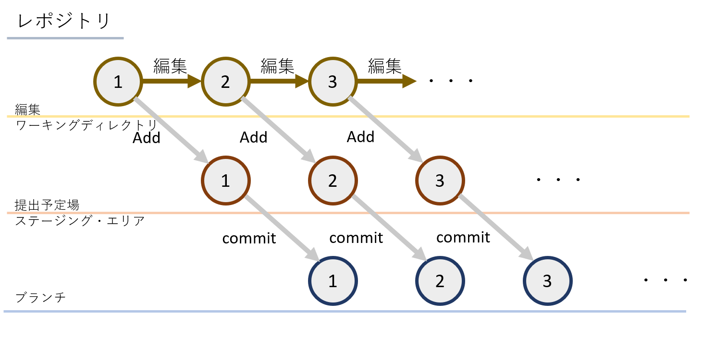
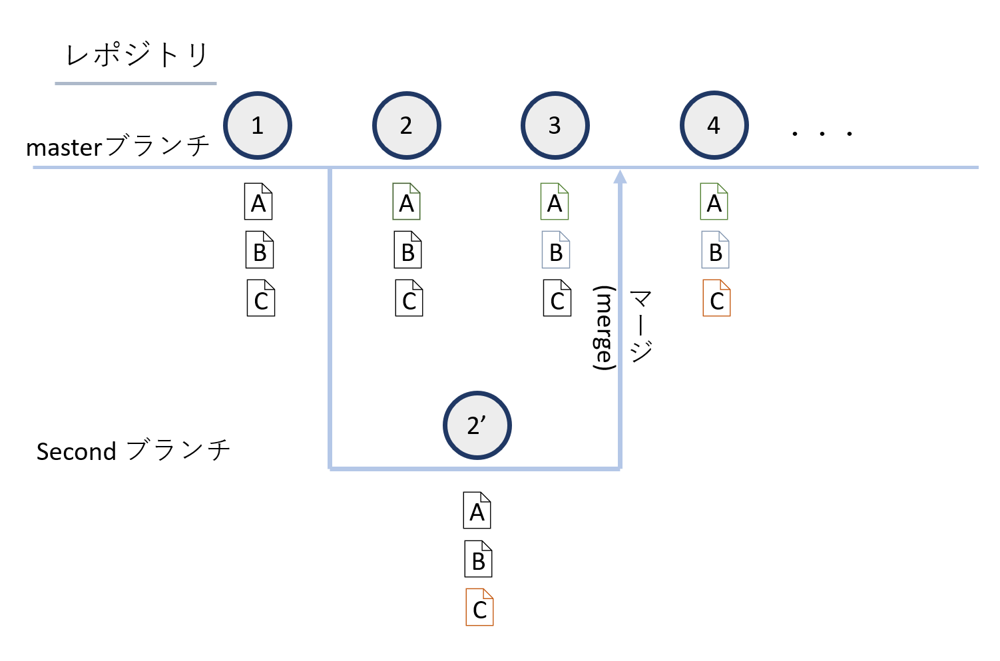
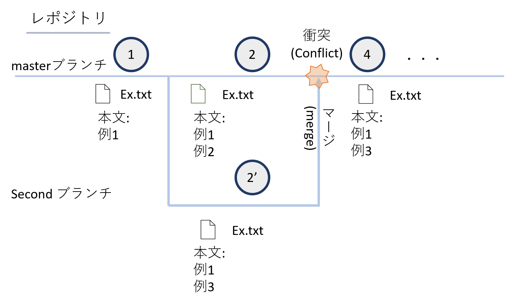

# Gitの使い方   
[最初](readme.md) 
[GitHub](github.md)
## 目次
<!-- TOC -->

- [Gitの使い方](#gitの使い方)
    - [目次](#目次)
    - [Gitの概要](#gitの概要)
    - [バージョン管理システム(VersionControlSystem, VCS)について](#バージョン管理システムversioncontrolsystem-vcsについて)
    - [開発の流れ](#開発の流れ)
        - [概略](#概略)
        - [開発を始める](#開発を始める)
            - [補足 監視対象からはずす](#補足-監視対象からはずす)
        - [修正したファイルの登録](#修正したファイルの登録)
        - [ファイルの削除](#ファイルの削除)
        - [補足 --chachedオプション](#補足---chachedオプション)
        - [ファイル名の変更](#ファイル名の変更)
    - [バージョンを遡る](#バージョンを遡る)
        - [コミットIDを取得する](#コミットidを取得する)
            - [補足 ログの体裁](#補足-ログの体裁)
        - [昔を参照する](#昔を参照する)
        - [特定ファイルだけ過去に戻す](#特定ファイルだけ過去に戻す)
        - [コミットごと昔の状態に戻す](#コミットごと昔の状態に戻す)
    - [各種操作の取り消し](#各種操作の取り消し)
        - [誤った修正を施したとき](#誤った修正を施したとき)
        - [ステージング・エリアに誤って登録したとき](#ステージング・エリアに誤って登録したとき)
        - [誤った状態でコミットしたとき](#誤った状態でコミットしたとき)
    - [ブランチ](#ブランチ)
        - [俯瞰](#俯瞰)
        - [ブランチの創造](#ブランチの創造)
            - [補足 -b](#補足--b)
            - [補足 ブランチ名の変更](#補足-ブランチ名の変更)
        - [マージ](#マージ)
        - [コンフリクト(衝突した)とき](#コンフリクト衝突したとき)
        - [ブランチの削除](#ブランチの削除)
            - [参考 マージされているブランチ / されていないブランチを把握する](#参考-マージされているブランチ--されていないブランチを把握する)
    - [Git終わり](#git終わり)

<!-- /TOC -->
## Gitの概要
Gitとはプログラムの開発に便利なVCSの一つです。これにより、より安全な開発ができるようになります。

## バージョン管理システム(VersionControlSystem, VCS)について
過去の状態に復元できるようにするためにデータの差分を保存することで、問題が発生したときにどの段階でそれが生じたのかを調べたり、書いているときにぐちゃぐちゃになってしまったときに戻せるようにすることを可能にするシステムのことです。Gitはこのシステムの内の一つです。


## 開発の流れ
### 概略

では、まず大まかにどのように管理していくのかを見ていきましょう。



１番上の編集と銘打った黄色の線が手元で編集している場(
**ワーキングディレクトリ**
)です。ここの
**修正済**
の内容を
**ステージング・エリア**
(
**インデックス**
)と呼ばれる黄赤色で引いた線上の提出予定場に
**Add**
していきます。その後、このステージング・エリアに登録した
**ステージ済**
の内容を今青色で引いた線上の
**ブランチ**
にコミットしていくことで、バージョン情報を記録していきます。このとき、最新のバージョンのことを一般に
**HEAD**
と呼ぶので覚えておきましょう。


### 開発を始める
まずは次のコマンドで適当なディレクトリを作成します。

```sh
$ cd         #ホームディレクトリに移動
$ mkdir EX   #EXという名のディレクトリを作成
```

一応VSCodeでそのディレクトリを開いておくと良いかもしれません。このディレクトリが先程の黄色の編集線に該当します。

Gitレポジトリとして、そのディレクトリを登録します。

```sh
$ git init
```
これにより、そのディレクトリに`.git`というサブディレクトリが作成されその内部にバージョン情報を格納していきます。(基本的にユーザがこのディレクトリに触れることはありません。中身が気になる場合は
[ここ](https://git-scm.com/book/ja/v2/ch00/ch10-git-internals)を参照すれば書いてあります。)

これで先程の青線のレポジトリが用意されました。

適当なファイルを作成してみましょう。

```sh
$ echo 例1 >> example.txt #example.txtに"例1"という文字列を追記
$ cat example.txt         #example.txtの中身を出力
例1
```

試しにVSCodeで確認しても"例1"という文字列が格納されたことがわかりますね。

ここでGitの状態を確認してましょう。

```sh
$ git status     #git状態を確認する
On branch master

No commits yet

Untracked files:
  (use "git add <file>..." to include in what will be committed)
        example.txt

nothing added to commit but untracked files present (use "git add" to track)

```

まだ監視対象になっていないので、`example.txt`がUntracked filesに分類されていることがわかります。

このファイルをGitのバージョン情報の監視対象にしてみましょう。

```sh
$ git add example.txt    #git のステージング・エリアに登録する
```

これで、先程の黄赤色のステージング・エリアに`example.txt`を登録することができました。

ここでも試しに状態を確認してみると、
```sh
$ git status
On branch master

No commits yet

Changes to be committed:
  (use "git rm --cached <file>..." to unstage)
        new file:   example.txt

```

となり、Changed to be committed(これからコミットされる予定にあるもの)に分類されていることがわかります。

ではコミットすることで、バージョン登録してみましょう。

```sh
$ git commit -m "Example Text" 
```

このコマンドでいまステージング・エリアにあるファイルを"Example Text"というコメントを付けてコミットすることが出来ます。このコメントは後にバージョンを遡る時のヒントとなるので、このコミットによってどのような変更をしたかを把握できる完結なコメントを残すようにこころがけましょう。

ここまでで、新しいファイルをステージング・エリアに登録し、その後コミットすることでバージョン履歴を更新するところまで出来るようになりました。

#### 補足 監視対象からはずす
<!-- - 全てファイルを同時に登録するときは、`-A`のオプションを使うことが出来る。
```sh
$ git add -A #全てのファイルを一度に登録
``` -->

今後、GitHubを使うにあたり認証鍵のデータなどの機密情報をGitに監視させるのは望ましくありませんね。そこでGitの監視対象から意図的に外すために`.gitignore`ファイルを作成して登録することで、このディレクリ以下(サブディレクトリ)のファイルが無視するように設定することができます。
**記法**<br>
```gitignore
# #から始まる行はコメント扱い
# 先頭に空白を設けることでもコメントになる

# FILE_NAMEという名前のファイル / ディレクトリを無視する時
FILE_NAME

# DJR_NAMEという名前のディレクトリごと無視するとき
# 末尾に/を追加
DIR_NAME/

# 相対パスで指定のファイルを除くこともできる
# DIRディレクトリのFILEファイルを無視するとき
DIR/FILE

# 反対に、指定のファイルの無視を取り消すとき
# 先頭に!をつける
!FILE_NAME

# ワイルドカード
# 次の条件をまとめて記述できる

# 任意の文字列は*でまとめられる
# 例:.txtという拡張子のファイルを一度に無視するとき
*.txt

# \を除く、任意の一文字は?でまとめられる
# 例:AA.txt, AB.txtを一度に無視するとき
A?.txt

# その他、[a-z]や**なども使える。

# 競合する設定内容は、下に記述されるものほど、また、下の階層の.gitignoreファイルに記述されたものほど優先順位が高い(上書きされていく)
```

既にaddしてしまったり、監視対象に追加してしまったファイルはこの限りではありません。注意しましょう。

詳細は[ここらへん](https://qiita.com/anqooqie/items/110957797b3d5280c44f)を見ると良いかもしれません。


### 修正したファイルの登録

では次に、監視対象になっているファイルを編集しコミットしてみましょう。基本的には先程と同じ流れになります。

1. `example.txt`の編集

```sh
$ echo \例2 >> example.txt   #example.txtに改行を挟んだのち"例2"と追記
$ cat example.txt             #example.txtの内容を出力
例1
例2
```

このコマンドによって、`example.txt`に"例2"と追記しました

この状態でgitの状態を確認してみましょう。

```sh
$ git status
On branch master
Changes not staged for commit:
  (use "git add <file>..." to update what will be committed)
  (use "git restore <file>..." to discard changes in working directory)
        modified:   example.txt

no changes added to commit (use "git add" and/or "git commit -a")
```

not stagedかつmodifiedに分類されている様子が観察されますね。

2. 編集内容を確認してみましょう。

次のコマンドでどのような編集を施したか知ることが出来ます。

```sh
$ git diff
diff --git a/example.txt b/example.txt
index 58a2ac2..2de1330 100644
--- a/example.txt
+++ b/example.txt
@@ -1 +1,2 @@
 例1
+例2
```

例にという文字が追記されたことが確認できますね。

3. ステージング・エリアに追加してみましょう。

先程と同じ`git add`コマンドで登録できます。
```sh
$ git add example.txt

```

同じく確認します。

```sh
$ git status
On branch master
Changes to be committed:
  (use "git restore --staged <file>..." to unstage)
        modified:   example.txt

```

分類が`Changes not staged for commit:`から`Changes to be committed:`にかわったことが観察されますね。

あとは同じく

```sh
$ git commit
```
コマンドでコミットすることができるのですが、ここでは試しにここでもう一度ファイルを編集してみましょう。

```sh
$ echo \例3 >> example.txt   #example.txtに改行を挟んだのち"例3"と追記
$ cat example.txt  
例1
例2
例3  
```

さて、ではここで状態を確認してみましょう。

```sh
$ git status
On branch master
Changes to be committed:
  (use "git restore --staged <file>..." to unstage)
        modified:   example.txt

Changes not staged for commit:
  (use "git add <file>..." to update what will be committed)
  (use "git restore <file>..." to discard changes in working directory)
        modified:   example.txt

```

同一ファイルが`Changes to be committed`かつ、`Changes not staged for commit`に分類されていますね。ステージング・エリアに登録されているファイルは先程addしたファイルで修正済みエリアにあるファイルは今修正したものになっています。よってこの状態でコミットした場合、そのまま以前ステージング・エリアに登録したファイルでバージョン登録され、`git add`した場合、今編集したファイルがコミットされます。

### ファイルの削除
では、反対にファイルの削除はどのように行うのかが疑問にあがるとおもいます。それは次のコマンドで行うことが出来ます。

```sh
$ git rm ファイル名
```

試してみましょう。

```sh
$ touch example2.txt   #example2.txtの作成
$ ls                   #このディレクトリの内容を表示
example.txt  example2.txt
```

あたらしく`example2.txt`を作成しました。これをまずはコミットしてから削除する場合、次のコマンドであらわされます。

```sh
$ git add example2.txt               #example2.txtをステージング・エリアに登録
$ git commit -m "example2.txtの作成" #コミット
$ git rm example2.txt                #example2.txtを削除した記録をステージング・エリアに登録
$ git commit -m "example2.txtの削除" #コミット
```

### 補足 --chachedオプション
- `--cached`オプションで監視対象からのみはずすこともできます。
```sh
$ git rm FILE_NAME --chached
```
 
### ファイル名の変更
次のコマンドでファイル名を変更した上で、監視対象に継続して加えることができます。

```sh
$ git mv OLD_NAME NEW_NAME
```
これは次のコマンドを打つことと同値です。

```sh
$ mv OLD_NAME NEW_NAME
$ git rm OLD_NAME
$ git add NEW_NAME
```

別にこれでも構いませんが、敢えてそうする必要もないでしょう。

## バージョンを遡る
### コミットIDを取得する
これまでバージョンの登録だけ行ってきましたが、実際にそのバージョンに遡ってみましょう。

```sh
$ git log  # コミット履歴を確認する
commit 4402016c1054bfa69a242efa064978677e773d66 (HEAD -> master)
Author: TKMacs <mail address>
Date:   Sun Jun 14 19:08:31 2020 +0900

    example2.txtの削除

commit 4bdf23532e35308460104237b6c00148ea256f9b
Author: TKMacs <mail address>
Date:   Sun Jun 14 19:07:57 2020 +0900

    example2.txtの作成

commit 6c246211a8609f6eabb77dfa78dcde55e6dea1e5
Author: TKMacs <mail address>
Date:   Sun Jun 14 18:19:10 2020 +0900

    Example Text
```


このように次の書式に従ったコミット一覧が表示されます。

```sh
commit コミットID
Author: 名前 <mail address>
Date:   時間

    コミットメッセージ
```

#### 補足 ログの体裁
このログの表示形式はいじることが出来ます。詳細は[ここ](https://git-scm.com/book/ja/v2/Git-%E3%81%AE%E5%9F%BA%E6%9C%AC-%E3%82%B3%E3%83%9F%E3%83%83%E3%83%88%E5%B1%A5%E6%AD%B4%E3%81%AE%E9%96%B2%E8%A6%A7)みると良いです。

### 昔を参照する

この状態で試しに最初の状態を参照してみましょう。
1
```sh
$ git checkout 最初のコミットID

$ cat example.txt
例1
```

たしかに最初の状態にもどっていることが観察されますね。

先頭(ＨＥＡＤ)にもどすときは

```sh
$ git checkout HEAD #先頭にもどす
```
で戻すことができる。

### 特定ファイルだけ過去に戻す

次のように特定のファイルのみ過去からとってくることが出来る。

```sh
$ git checkout コミットID ファイルパス
```

### コミットごと昔の状態に戻す

コミットを取り消して以前の状態に戻したい時は次のコマンドを入力します。

```sh
$ git reset --hard コミットID  #バージョンを戻す
```

## 各種操作の取り消し
### 誤った修正を施したとき
次のコマンドでファイルの状態を戻すことができます。

```sh
$ git checkout -- ファイルパス
```

### ステージング・エリアに誤って登録したとき

次のコマンドでステージング・エリアから引きずり落とすことが出来ます。(編集)

```sh
$ git reset HEAD ファイルパス
```

このresetコマンドはとても便利なので、[公式の詳細ページ](https://git-scm.com/book/ja/v2/Git-%E3%81%AE%E3%81%95%E3%81%BE%E3%81%96%E3%81%BE%E3%81%AA%E3%83%84%E3%83%BC%E3%83%AB-%E3%83%AA%E3%82%BB%E3%83%83%E3%83%88%E3%82%B3%E3%83%9E%E3%83%B3%E3%83%89%E8%A9%B3%E8%AA%AC#r_git_reset)を見ておくことをおすすめします。


### 誤った状態でコミットしたとき

addのし忘れや、コミットメッセージの変更をしたいとき、次のコマンドでコミットをやり直すことが出来ます。

```sh
$ git add FILE_NAME                  # 登録しわすれたときは登録する
$ git commit --amend -m "NewMessage" # 再コミット
```

ただし、後にでてくるGitHubに上げたあとこの操作をすることは望ましくありません。

## ブランチ
### 俯瞰
これまで一つのブランチという時間軸のなかで、行ったり来たりする術を学んできました。しかしGitの機能はこれだけではありません。ブランチを複数作成することで並行世界を創造することもできます。図を用いて俯瞰しましょう。




この図に於けるmasterブランチが今まで話をしてきたような、開発の主軸となるブランチです。いま①の段階のA, B, Cスクリプトで構成されるこのプログラムに対して大きな仕様変更を設けたいとしましょう。このようなとき、今の状況を横に退避させた状態で開発をすすめることがしばしば望ましくあります。このような時にもちいるのがブランチです。図のように、ここでSecondブランチを新しく創造し、masterブランチは退避させた上でCファイルに対して大きな変更を加えます。こうして最終的にうまく動くようになった時点でmasterブランチのファイルを更新する(=
**マージ**
する)ということをします。これにより、直列にプログラムを編集していくよりも、より安全な形での開発ができるのです。


### ブランチの創造

ではまず、ブランチの作成をしていきましょう。次のコマンドを実行するだけです。ここでは新たに生成するブランチ名を便宜的にnewBranchとします。

```sh
$ git branch newBranch  # あらたなブランチを生成
```

実際に生成出来ているかを確認するためには次のコマンドを入力します。

```sh
$ git branch            #ブランチの一覧を確認
*master
newBranch
```
*(アスタリスク)が付いているのが今皆さんがいるブランチです。確かに`newBranch`という名の新たなブランチが生成されていることがわかりますね。

それでは今度はこの新しく生成したこのブランチに入ってみましょう。次のコマンドを入力します。

```sh
$ git checkout newBranch # ブランチの移動
$ git branch             # ブランチの一覧を確認
master
*newBranch

```

これで新しいブランチに移動することができました。簡単ですね！

#### 補足 -b

以上のような、新たなブランチを生成して、そのブランチに移動するという作業は次のコマンドで同時に行うことができます。

```sh
$ git checkout -b newBranch
```

#### 補足 ブランチ名の変更

今いるブランチの名称を変更したい場合は次のコマンドで変更できます。

```sh
$ git branch -m NEW_NAME # 今いるブランチの名称をNEW_NAMEに変更
```

### マージ
一通りの開発を終えたらマージする必要がありますね。次のコマンドを実行することでこの要求を満たすことができます。

```sh
$ git checkout master # マージ先(枝分かれ元)に移動
$ git merge newBranch # マージを実行
```

### コンフリクト(衝突)したとき
マージ先とマージ元でどちらとも編集が加えられたとき、コンフリクトが発生します。例として次のような状態を考えてみます。



Ex.exeというファイルをmasterブランチとSecondブランチ双方で編集してしまった、という状況です。これを解決してみましょう。

まずはこの状況を作りだすために、どこかのディレクトリを開いたBash上で次の文をまるごとコピペしてください。

```sh
mkdir ex            # exというディレクトリを作成
cd ex               # ex内に移動
git init            # gitレポジトリを作成
echo 例1 > Ex.txt   # 例1と書いたEx.txtを作成
git add Ex.txt      # Ex.txtをステージング・エリアに追加
git commit -m "例1" # 例1というコミットメッセージを残してコミット
git branch Second   # Secondブランチを作成
echo 例2 >> Ex.txt  # masterブランチのEx.txtに例2と追記
git add Ex.txt      # Ex.txtをステージング・エリアに追加
git commit -m "例2" # 例2というコミットメッセージを残してmasterブランチにコミット
git checkout Second # Secondブランチに移動
echo 例3 >> Ex.txt  # SecondブランチのEx.txtに例3と追記
git add Ex.txt      # Ex.txtをステージング・エリアに追加
git commit -m "例3" # 例3というコミットメッセージを残してSecondブランチにコミット
git checkout master # masterブランチに移動

```

これの状態で試しにマージを試みてみましょう。

```sh
$ git merge Second
Auto-merging Ex.txt
CONFLICT (content): Merge conflict in Ex.txt
Automatic merge failed; fix conflicts and then commit the result.

```
Ex.txt の内容が衝突していると怒られてしまいました。ではこれを解決しましょう。このコマンドを実行すると、賢いgitは衝突しているファイルの該当箇所に次のフォーマットの解決提案を追記してくれます。


- 一般形

```sh
<<<<<<< HEAD
マージされようとしているブランチ(ここでいうmaster)の内容
=======
マージしようとしているブランチ(ここでいうSecond)の内容
>>>>>>> Second

```

今回は次のようになるはずです。


- Ex.txt

```
例1
<<<<<<< HEAD
例2
=======
例3
>>>>>>> Second
```

この箇所を欲しい方だけのこし、不要部分を消します。今回は例3を残すことにしましょう。

```
<<<<<<< HEAD    ☆
例2             ☆
=======         ☆
例3
>>>>>>> Second  ☆
```
いま☆を付けた行を消して次のように必要部分だけ残します。

```
例3
```
このように修正したら、次のようにステージしなおすことで、gitに修正したことを伝えます。

```
$ git add Ex.txt # Ex.txtをステージング・エリアに追加
```

そうしたら、変更をコミットして改めてマージを完了させます。

```sh
$ git commit -m "コニットメッセージ"
```

このときのコミットメッセージはどこをどのように修正したかを記述しておくと尚よいでしょう。長くなるときは、-mをつけずにcommitすることでエディタが開き、長いメッセージを残すことが出来ます。

### ブランチの削除
以上の手順でマージしたら、マージ元のブランチは不要なので削除したいですね。次のコマンドで削除することができます。

```sh
$ git branch -d 削除するブランチ名
```

#### 参考 マージされているブランチ / されていないブランチを把握する

次のコマンドでマージされているブランチとされていないブランチの一覧を知ることができます。

```sh
$ git branch --merged    # マージされているブランチ一覧
$ git branch --no-merged # マージされていないブランチ一覧
```

## Git終わり
ここまででGitの話は終了です。ここからは共同開発するのに必要なGitHubの話をします。

[GitHub](github.md)
