# Githubの使い方
[最初](readme.md) 
[Git](git.md)
## 目次

<!-- TOC -->

- [Githubの使い方](#githubの使い方)
    - [目次](#目次)
    - [GitHubとはなんぞや](#githubとはなんぞや)
    - [俯瞰](#俯瞰)
    - [リモートレポジトリを作成する](#リモートレポジトリを作成する)
    - [ローカルレポジトりからPush](#ローカルレポジトりからpush)
        - [参考 リモートブランチを削除する](#参考-リモートブランチを削除する)
    - [接続先を登録する](#接続先を登録する)
    - [リモートレポジトリを手元に複製する](#リモートレポジトリを手元に複製する)
    - [リモートレポジトリから更新をとってくる](#リモートレポジトリから更新をとってくる)
        - [参考 fetch](#参考-fetch)
    - [Pull Requestを送る](#pull-requestを送る)
    - [共同開発者を登録する](#共同開発者を登録する)
    - [参考 Fork](#参考-fork)
    - [参考 GitHub Pages](#参考-github-pages)
    - [おわりに](#おわりに)

<!-- /TOC -->

## GitHubとはなんぞや
今までGitを使ってどのようにバージョン情報を残しつつ開発していくのかの説明をしてきました。しかし実際は単独でプログラム開発する場面よりも複数人で共同開発していく場面が多くあります。このような場合にGitのバージョン情報を共有することで、効率的に並行作業を実現をするのがGitHubです。

## 俯瞰
それでは、どのようなものなのか、簡単に見てみましょう。

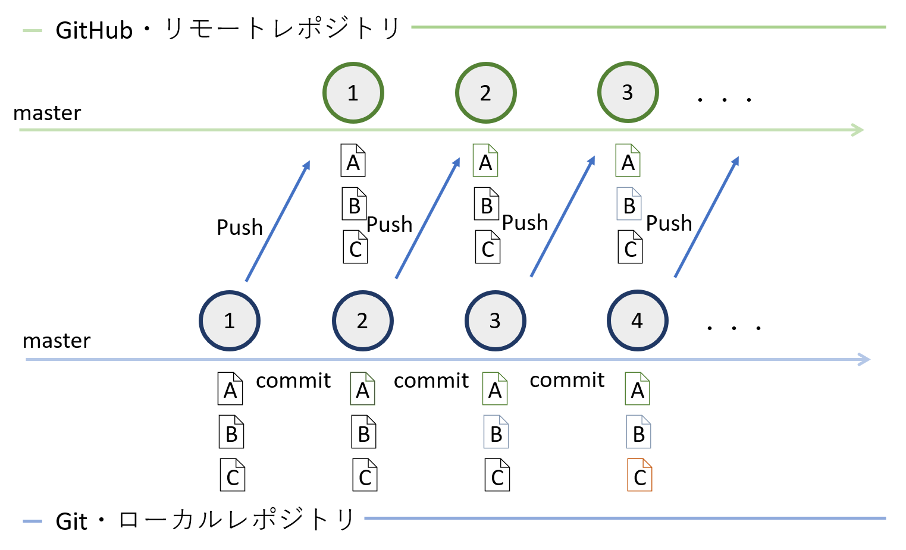

この図において下半分が今までみてきた手元で操作するローカルレポジトリです。コミットしたバージョン情報をGitHubサーバ上に作成したリモートレポジトリに送信していく(
**push**
)していくというのが基本構造です。そこから複数人がこのレポジトリに参加すると次のようになります。

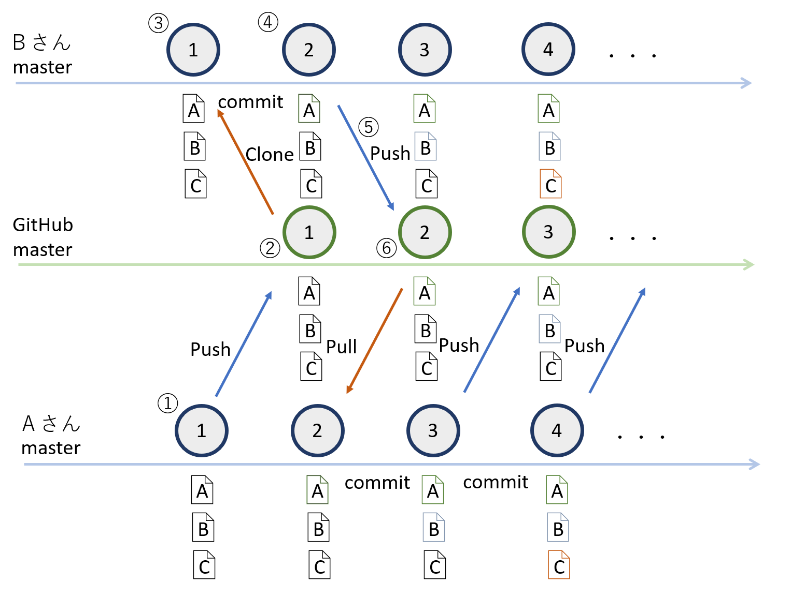

図の丸付きの番号で記した順に見ていきましょう。

1. Aさんがローカルレポジトリをつくり、A, B, CファイルをGithub上のmasterブランチにPush
2. remote/oirigin/masterのブランチにマージされる。
3. Bさんがローカル環境にこのレポジトリを複製(
    **Clone**
    する)
4. Bさんが変更をコミットする。
5. BさんがGitHub上のremote/origin/masterブランチにPushする。
6. マージされる。

それでは各々具体的な操作を学んでいきましょう。

## リモートレポジトリを作成する
実験用に実際にリモートレポジトリを作成してみましょう。

[GitHub](https://github.com/)
に行き、Newボタンを押します。

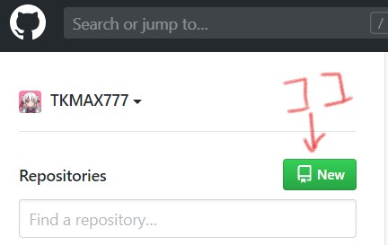

そうしたら次のように必要事項を入力します。

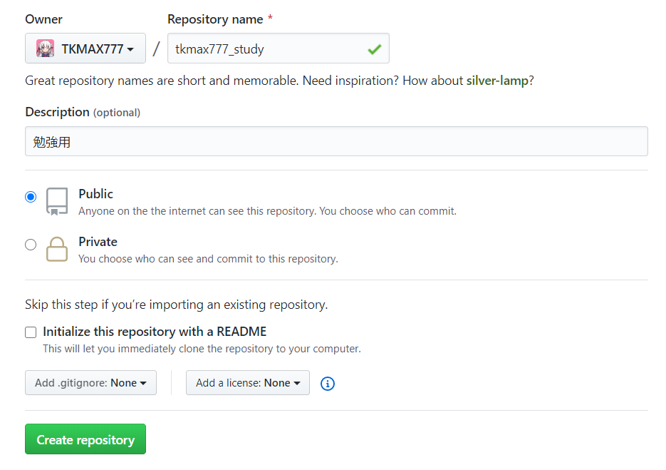

そうしたら`Create repository`を押し、作成しましょう。

このような画面がでれば、晴れてレポジトリの作成が完了しました。

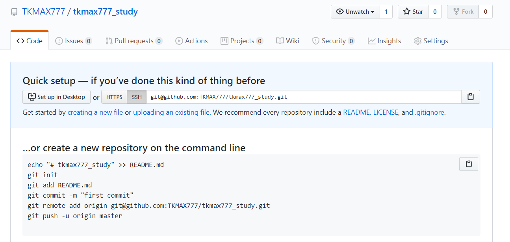

このとき表示される、`git@github.com:...`のアドレスは後につかうのでコピーしておきましょう。

## ローカルレポジトりからPush
次のコマンドでリモートレポジトリにPushできます。

```sh
$ git push git@github.com:...(さっきの) master:master 
```
このコマンドがそれぞれどういう意味かというと、

```sh 
git push
```
この部分は単にこれからpushすることを命令しています。

```sh
git@github.con:...
```

この部分はリモートレポジトリの住所を示しています。

```sh
master:master
```

この部分の前者のmasterはローカルレポジトリのmasterブランチを、後者はリモートレポジトリのmasterブランチを示しています。

全体では、指定した場所にローカルのmasterブランチをリモートのmasterブランチに送ってね☆っていう意味ということですね。

さて、とはいえこんなの一々記述するのはとても面倒ですね。そこで`master:master`の
**リモートブランチ名**
は省略して、単に`master`と記述できます。

ここまでの知識でためしにレポジトリの説明を上げてみます。次のような`readme.md`を作成してみましょう。

```md
# 勉強用レポジトリ
このように説明を加えることが出来ます。
```

これをあたらしく作ったローカルレポジトリの最上層のディレクトリに格納しましょう。その状態でGitのコミットバージョンを更新した上で、これをpushしましょう。

以上をコマンドで示すと次のようになります。

```sh
mkdir ex # exというディレクトリを作成
cd ex    # exに移動
git init #gitレポジトリを作成
echo \# 勉強用レポジトリ >> readme.md 
echo このように説明を加えることが出来ます。 >> readme.md # readme.mdに内容を記述
git add readme.md            # readme.mdをステージする
git commit -m "Readmeの作成" # commit
git push git@github.com:...(さっきの) master # push
```

この状態で
[github.com](https://github.com)
の先程のレポジトリに行ってみてください。変化があるはずです。

### 参考 リモートブランチを削除する
リモートブランチを削除するときは、

```sh
$ git push origin :削除するブランチ名
```

`:削除するブランチ名`と書くことで、無を送信することになるので結果削除される、ということです。

## 接続先を登録する
しかし、まだ`git@github.com:...`の部分が明らかに冗長です。こんなの毎回かいていたら日が暮れてしまいます。そこで次のコマンドで接続先に登録することができます。

```sh
$ git remote add origin git@github.com:...

```

これによって、アドレスを入力するかわりに単に`origin`と書くだけで接続できるようになりました。便利ですね。ここの`origin`が何故`origin` なのか。後にForkで触れます。

## リモートレポジトリを手元に複製する
では今度はこのようにして他の人が作ったレポジトリを手元にクローンしてみましゅう。

```sh
$ git clome git@github.com:... # クローンする
```

簡単ですね！


## リモートレポジトリから更新をとってくる

さて、ここまでではまだ単独での開発しかできません(毎回クローンすれば話は別ですが…。)。複数人で開発するためには他の人がつくった差分をとってこれるようになる必要がありますね。そこで冒頭にも書いたように今度はpullしてみましょう。

方法は簡単で次のコマンドを打つだけです。

```sh
$ git pull origin master:master
```
この`master:master`の前者はリモートレポジトリで後者はローカルレポジトリです(持ってくる元:持っていく先という構文なので先程とは反対向きになっています)。これも同じく諸略可能で、
**リモート**
側のブランチ名のみ記せば十分です。

### 参考 fetch
お気づきの方もいるかもしれませんが、pullという操作は、ローカルブランチをリモートブランチのバージョン履歴をとっていきて手元のブランチとマージする作業です。つまり…

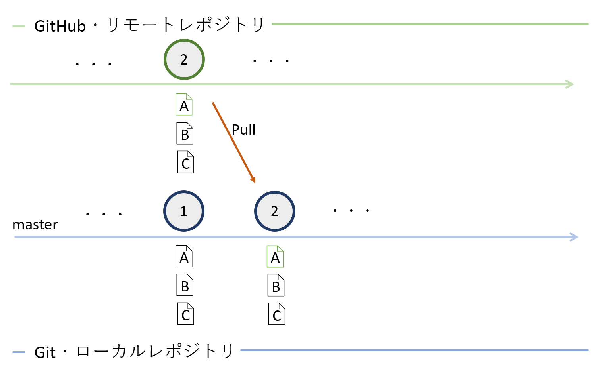

これがpullですが、これは

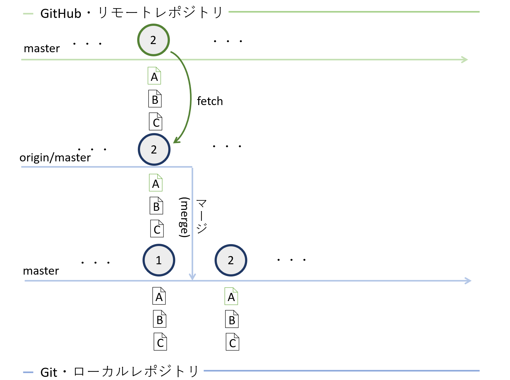

このように手元のレポジトリにリモートブランチを複製して(
    **fetch**
    )それをローカルブランチにマージする作業を背後でしています。これをコマンドで分けて実行するとこうなります。

```sh
$ git fetch origin        # リモートレポジトリから複製
$ git merge origin/master # それをマージ
```

## Pull Requestを送る

共同開発するときは、手元でマージするのでは無く、他の人にも確認してもらうことが望まれます。そこで、GitHubではその変わりに`origin/master`ブランチにpullするためのリクエスト、pull requestを出すことが出来ます。方法は極めて直感的です。

まず、そのレポジトリのGitHubのページに行きます。そうした後、変更が加えられているブランチところにある`Compare & pull request`を押します。

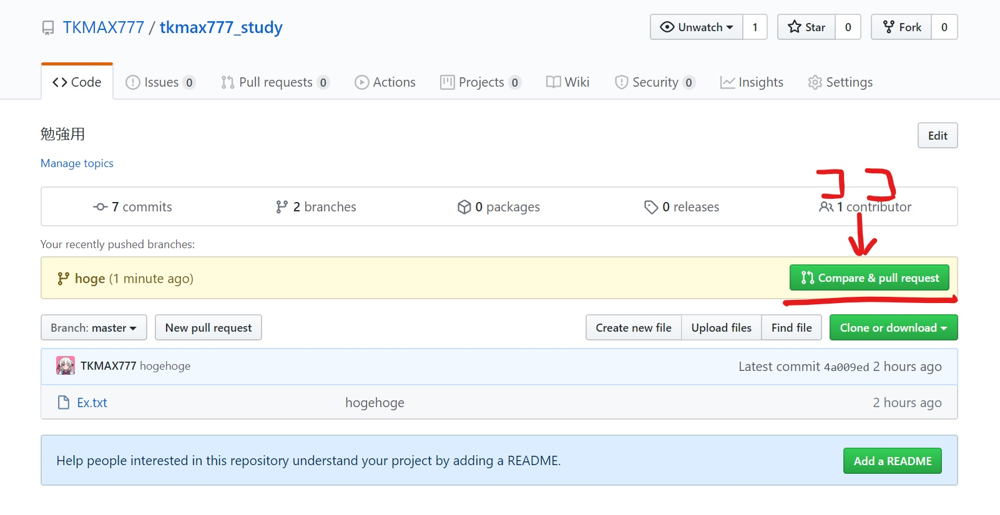

その後この、`Create pull request`を押せば完了です。

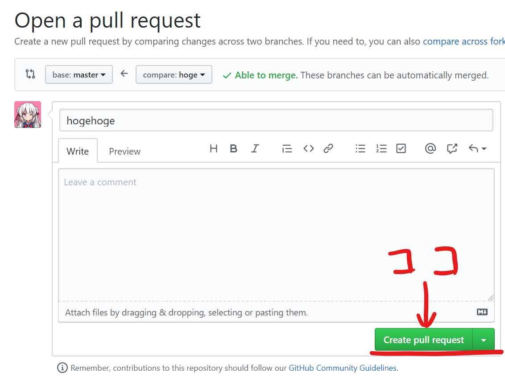

わかりやすいですね。

## 共同開発者を登録する

ここまで、どのようにレポジトリを扱うかをみてきました。しかし実際にはそれだけではなく、共同開発するためには権限を付加する必要があります。

まずは、レポジトリの設定ページに行きます。

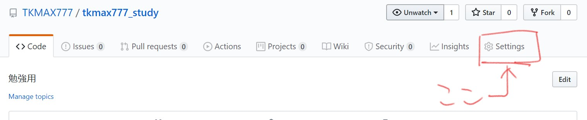

サイドバーの`Manage access`を押します。

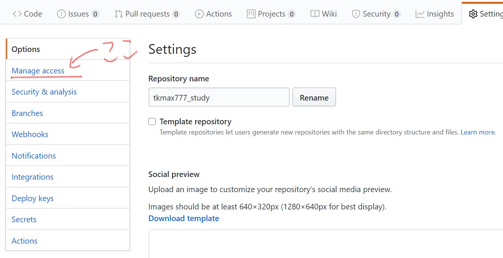

そうして出てきた`Invite a collaborator`を押します。

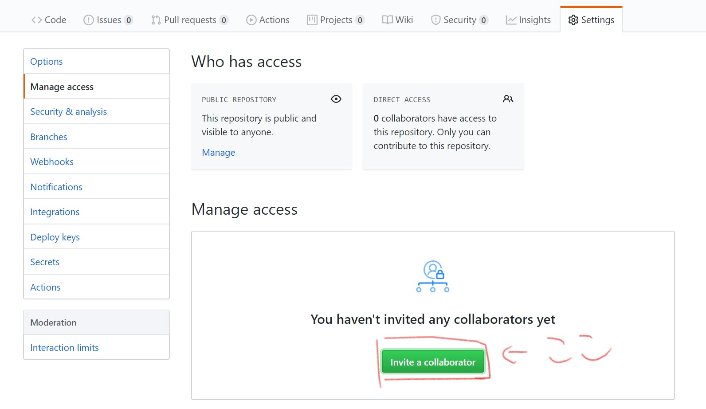

ここに共同開発するユーザ名を入力すれば開発を始めることができます。

## 参考 Fork
既にあるリモートレポジトリを複製して新たなリモートレポジトリを作成する場合はForkという機能を使います。

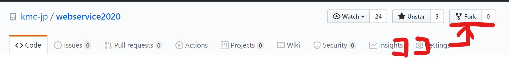

ここ押して自分のアカウントを選択すれば、自分のレポジトリに複製されます。こうして複製されるため、もととなるレポジトリをoriginと登録するのです。

## 参考 GitHub Pages
GitHubのレポジトリにあげたhtmlやmarkdownファイルを使ってWebページが作れます。そこまで難しくないので興味があれば是非使ってみてください。

[詳細](https://help.github.com/en/github/working-with-github-pages)

## おわりに

ここまで読めば、Git / GitHub が使えるようになったとおもいます。今後開発するときはどんどん使っていきましょう！

次回は WebServiceの開発に戻り、htmlとCSSの文法を学びます。お楽しみに。
