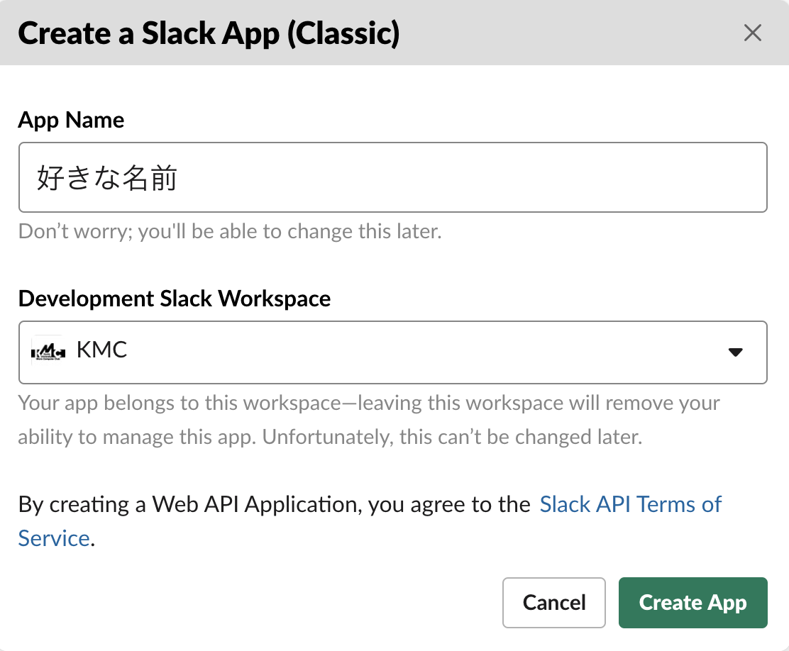
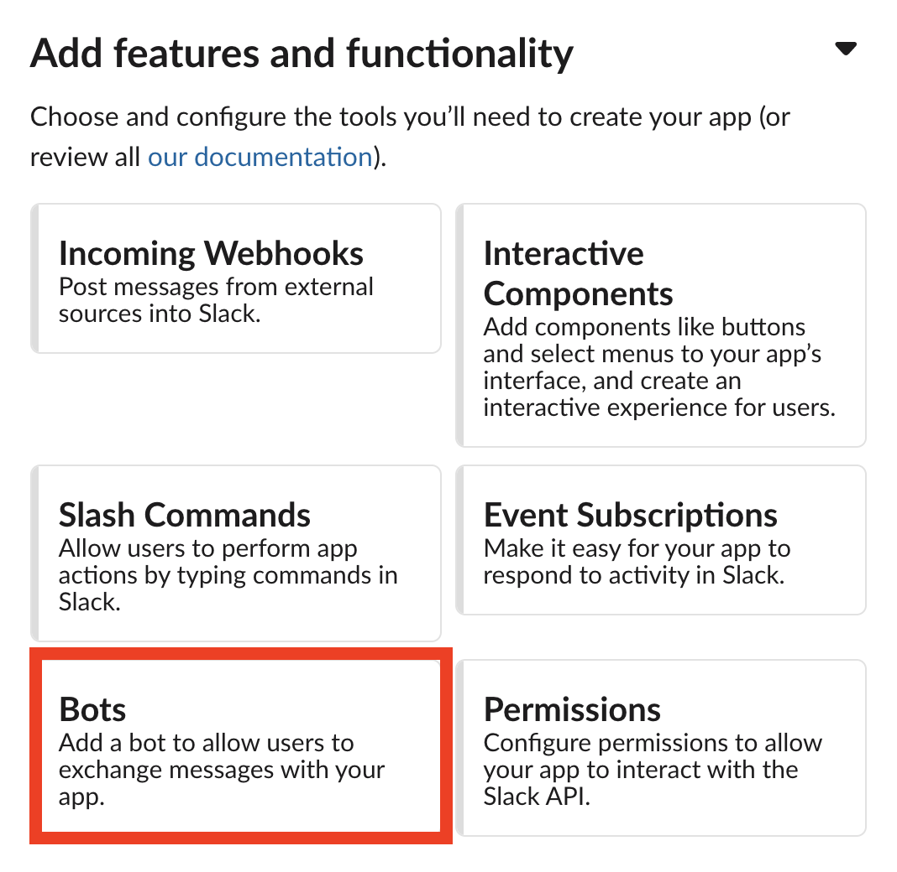
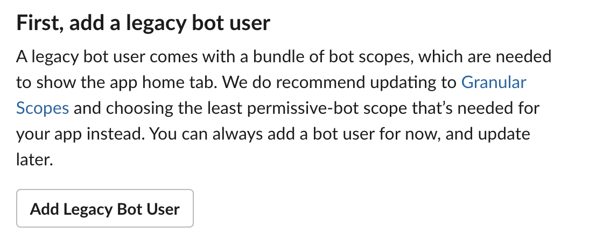
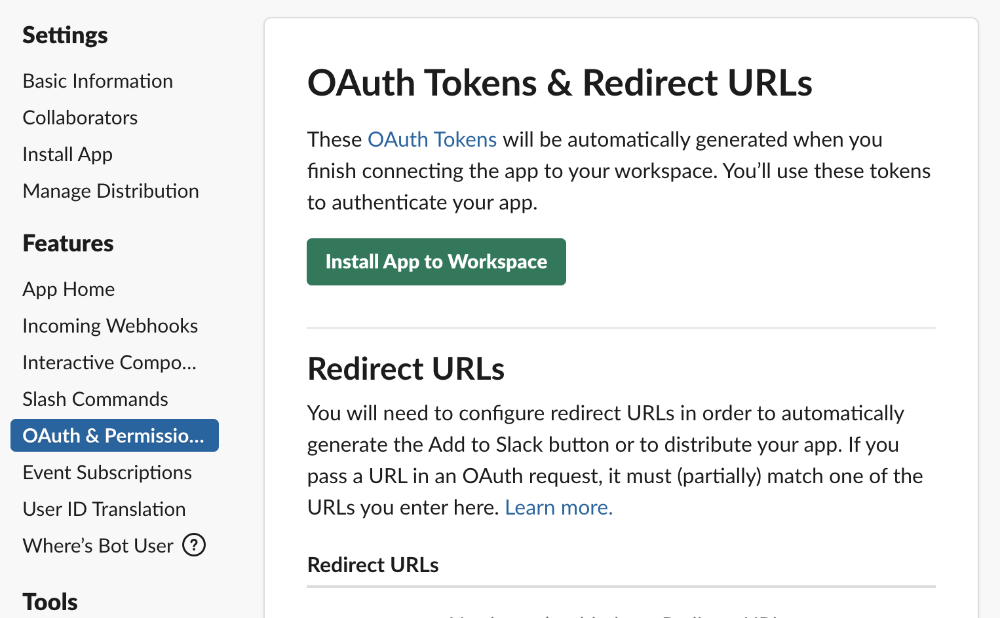

# デレマスBot

## 概要
デレマスのキャラクターの詳細を表示するBot。ランダム or 指名によってキャラを選択する。

## 準備

1. Slack用の外部パッケージを入れる。

```sh
$ go get -u github.com/nlopes/slack
```

2. SlackAppの作成
   1. [Slack Appの作成](https://api.slack.com/apps?new_classic_app=1)に飛ぶ
   2. 次の図を参考に入力
   
   3. Bots選択
   
   4. Add Legacy Bot Userを選択
   
   5. 必要事項を記入してAdd
   - 今回Display Nameは`Webservice2020_YOUR_NAME`にしましょう。
   6. `OAuth & Permissions`から`Install App to Workspace`選択
   
   7. 内容を確認したら`許可する`押しましょう。
   8. `OAuth & Permissions`に戻ると表示される、`xoxb-`から始まる`Bot User OAuth Access Token`を後に使います。

## 仕組み
### init関数
Golangではinit関数→main関数の順に実行される。

**補足-import-**

importするときにはこんな書き方もできる。

```go
import (
   f "fmt"
)
```
これをすると、パッケージ関数を実行するとき、

```go
fmt.Printf("Hello World!\n")
```
とかく所を

```go
f.Printf("Hello World!\n")
```
と書くことができる。これにより、書く手間を省くことができる他、`fmt`という名前のパッケージ名が被った場合、名前を変更できるというメリットもある。

またその他、

```go
import (
   _ "fmt"
)
```
と書くことで、importしても名前を与えないということができる。ここでポイントとなるのがinit関数なのです。

packageは引用されたとき、init関数が最初に実行されるため、名前が与えられていないpackageであってもinit関数だけは実行されます。

今回のプログラムでは、init関数で
[このページ](https://imascg-slstage-wiki.gamerch.com/%E3%82%A2%E3%82%A4%E3%83%89%E3%83%AB%E4%B8%80%E8%A6%A7)
からデレマスキャラの詳細を取得しています。

```go
func init() {
	var x []idol.Idol = idol.Get()//1
	b, err := json.MarshalIndent(x, "", "    ")//2
	if err != nil {
		panic("Marshal Error!")
	}
	err = ioutil.WriteFile(filepath.Join("..", "data.json"), b, os.ModePerm)//3
	if err != nil {
		panic("Write Error!")
	}
}
```

1. idol パッケージのIdol型Getメソッドを実行
   - この時デレマスのデータを取得している。
2. jsonパッケージのMarshalIndent関数を実行
   - json形式にxの中身を変換している。
3. ioutilパッケージのWriteFile関数を実行
   - data.jsonに記録している。

### main関数
```go
func main(){
	var api *slack.Client = slack.New(BotToken)//1

	RTM = api.NewRTM()//2

	go RTM.ManageConnection()//3

	for msg := range RTM.IncomingEvents {
		switch ev := msg.Data.(type) {
		case *slack.ConnectedEvent:
			fmt.Printf("Start connection with Slack\n")//4
		case *slack.MessageEvent:
			EV = ev
			ListenTo()//5
		}
    }
}
```

1. Botトークンをもとに、Slackとの通信をするための初期化をする
2. Real Time Messangerを作成。これで各種Slackとの通信を行う。
3. 通信を開始する。
4. Slackとの通信を開始したらメッセージを表示
5. メッセージが送信されたらListenTo関数を実行する。

