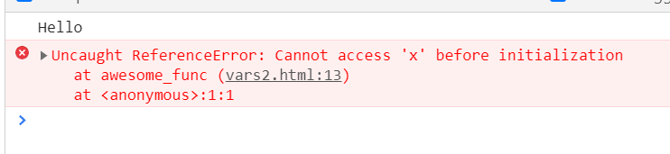

# 第一回

[次にすすむ](flow.md)

## 概要
後期初回。今回は前期に時間がなくて触れずに終わったJavaScriptについて、軽く使いかたを学んでいきます。

## 目次
<!-- TOC -->

- [第一回](#第一回)
    - [概要](#概要)
    - [目次](#目次)
    - [基本知識](#基本知識)
        - [DOM](#dom)
        - [JavaScript](#javascript)
    - [JavaScriptの世界でHello World!](#javascriptの世界でhello-world)
    - [前提事項](#前提事項)
        - [コメントの記法](#コメントの記法)
        - [console.log](#consolelog)
    - [宣言](#宣言)
    - [型](#型)
    - [型変換](#型変換)
    - [演算子](#演算子)
        - [補足 - +演算子をもちいた 文字列 => 数値 変換 -](#補足---演算子をもちいた-文字列--数値-変換--)
        - [補足 - NaN -](#補足---nan--)
        - [補足 - JavaScriptに於ける同一性 -](#補足---javascriptに於ける同一性--)
    - [function節](#function節)
    - [巻き上げ](#巻き上げ)
    - [参考](#参考)

<!-- /TOC -->

## 基本知識
世のなかのウェブページを眺めてみると、今まで学んできたような静的な描画のページだけではないことがわかります。例えば、Twitterでは、タイムラインが自動的に更新されていったり、ユーザアイコンにポインタを重ねるだけで、その人の詳細が出てきたりしますね。このように、ブラウザでは再読み込みをせずに動的にHTMLの要素を動かすことができるようになっています。この機能をささえている仕組み、それがDOMです。

### DOM
DOMとは
**Document Object Model**の略であり、HTMLなどの文章をプログラムから操作するためのインターフェースです。

### JavaScript
JavaScript(JS)は先のDOMを操作するために最もよく用いられるプログラミング言語です。その他、Node.jsやGASなどでサーバ側のプログラムを記述するのにも用いられます。

## JavaScriptの世界でHello World!
実際にJavaScriptでHello World!を出してみましょう。ブラウザのコンソールを表示して、次のプログラムを入力してください。

- プログラム

```js
console.log("Hello World!")
```

- 出力

```
Hello World!
```

簡単ですね！

## 前提事項

### コメントの記法

```js
// コメント
/*
複数行に
またがる
コメント
*/
```

上記のように、
`//`
もしくは
`/**/`を用いることで、コメントを挿入できます。Golangと同じですね。


### console.log

次のように記述することで、ブラウザのコンソール(開発者ビューにあるやつ)に出力することができます。

```js

console.log(arg1, arg2, ...)

```

arg: 任意の型

ここから、次回DOMの話に行くまでは全てコンソールをもちいてプログラムを実行していきます。

一応、次のように書式指定子を用いることが可能です。

```js
console.log("文字列:%s 数値:%d", "tkmax777", 61)
```

- 出力

```
文字列:tkmax777 数値:61
```

詳細は
[ここ](https://developer.mozilla.org/ja/docs/Web/API/console#Using_string_substitutions)
を参照すると良いでしょう。

## 宣言

JSでは次のように各種宣言することができます。

```js
// 変数
var x;
let y;

// 定数
const z;
```

以上の記述をするだけで、変数の宣言が行われます。型については後述しますが、記述する必要はありません。さて、var と letの違いが気になりますね。これらはスコープが異なります。

次の例を見てくださjい

```js
if (true) {
    var x = 5;
    let y = 5;

    console.log("x = " + x + " y = " + y); // => x = 5 y = 5
}
console.log("x = " + x + " y = " + y); // => x = 5 y = undefined

```

このように、varでは関数全体がスコープになるのに対し、letではブロックがスコープになります。varを下手に用いると、予期しない動作となる場合があるので、できるだけletを用いると良いでしょう。但し、グローバル変数の宣言にはvarしか用いられません。気をつけましょう。

- 注意<br>
JavaScriptに於いて、変数(識別子)の名称には規則があります。次の文はMDNからの引用です。

> アプリケーションで値を識別する名前として変数を使用します。変数の名前はあるルールに従って付けなくてはなりません。変数の名前は識別子とも呼ばれます。
> 
> JavaScript の識別子は必ずアルファベットかアンダースコア (_) かドル記号 ($) から始まらなくてはなりません。続く文字は数字 (0-9) も使えます。JavaScript は大文字・小文字を区別するため、使えるアルファベットは "A" から "Z"（大文字）と "a" から "z"（小文字）です。
> 
> JavaScript 1.5 からは å や ü といった ISO 8859-1 や Unicode のアルファベットも識別子に使えます。Unicode エスケープシーケンス のページに列挙されている \uXXXX 形式の Unicode エスケープシーケンスも識別子に使用できます。
> 
> Number_hits や temp99 や _name が使用できる名前の例です。

[引用元](https://developer.mozilla.org/ja/docs/Web/JavaScript/Guide/Variables)

## 型

それでは、JavaScriptの型を見ていきましょう。

基本的には次の型が用意されています。

| 型 | 説明 |
| --- | --- |
|`Boolean`|真偽値|
|`BigInt`|長整数。精度が自由な整数値|
|`Number`|整数もしくは不動性点数|
|`String`|文字列|
|`Object`|構造体|
|`null`|空集合|
|`NaN`|非数|
|`undefined`|未定義値|

他にもSymbol (シンボル)やErrorという型などもありますが、とりあえずのところは良いでしょう。JSでは変数の型は自動的に定義され、かつ動的に変化します、よって次のような操作は全く問題ありません。


```js
let x = "Hello";
console.log(x); // => Hello

x = 5;
console.log(x); // => 5

x = true;
console.log(x); // => true
```

<iframe src="html/vars.html" name="sample" width="90%" height="50">
    <a href="html/vars.html"></a>
</iframe>

## 型変換

型について学んだとき、次に気になるのはやはり型変換の方法でしょう。JavaScriptで問題になる型変換の方法は、数値 <=> 文字列の変換ですね。これはいたって簡単で、次のように行うことができます。

```js
// 数値 => 文字列
let num = 5;

console.log("数値は"+num+"です");

// 文字列 => 数値
let x = "5.1"

console.log("parseInt: "+parseInt(x, 10));  // => 5
console.log("parseFloat: "+parseInt(x));// => 5.1

```

数値=>文字列に関しては、必要になったときにStringとそのまま+演算子にて結合すれば勝手に変換されます。また、文字列=>数値に関しては、parseIntもしくはparseFloatを用いることで、それぞれ整数、浮動小数型に変換できます。parseIntの第２引数はその数の基数、通常は10です。

## 演算子
JavaScriptには`+`、`-`、`*`、`/`、そして`%`の演算子が用意されています。基本的な働きはGoと変わりません。ただし、この内`+`演算子は、Goと大きく異なる性質を持っています。

次の例を見てください。

```js
console.log("Hello" + "World!");

```

このプログラムはどのように動作するでしょうか。出力は次のようになります。

```
HelloWorld!
```

どうでしょうか。そうですね。Goとなんら違いはありません。では、次の例はどうでしょうか。

```js
console.log("3" + 3);
```

このプログラムはどうなるでしょうか。実はJavaScriptに於いてはこのプログラムは全く問題なく動作し、次のような出力が得られます。

```
33
```

そうです。文字列と数値は足しあわせることで、自動的に一つの文字列として処理されます。では、次の例ではどうでしょうか。

```js
console.log(3 + 3 + "3");
```

ひょっとしたらあなたは次の出力を期待するかもしれません。

```
333 # 間違い
```

しかし、JavaScriptに於いては次のようになります。

```
63
```

計算できる箇所があるため、先に計算されてしまうのですね。注意しましょう。

### 補足 - +演算子をもちいた 文字列 => 数値 変換 -

+演算子は、文字列を数値に変換する性質も持っています。次の例を見てください。

```js
console.log("3" + 3);  // => 33
console.log(+"3" + 3); // => 6
```

このように、文字列の前に`+`演算子を付けることで、簡単に数値へと変換することができます。

### 補足 - NaN -

先程の例ではうまく変換できましたが、ひねくれたユーザが文字列を入力するかもしれません。その場合は次のようになります。

```js
console.log(+"「さん」のつもり"); // => NaN
```

`NaN`と名乗る、何者かが出力されました。これは、非数値(Not a Number)であることを示す、Number型の値です。この値の扱いは少し面倒です。この数は次の性質を持ちます。

- 数値との演算を行ってもNaNを返す
- 自分自身と比較してもfalseを返す

これをプログラムで示すと次のようになります。

```js
console.log(3 + NaN);     // => NaN
console.log(NaN === NaN); // => false
```

※`===`については後に触れます。

数値がNaNかを判定するためには次のようにします。

```js
console.log(Number.isNaN(NaN)); // => true
```

覚えておきましょう。

### 補足 - JavaScriptに於ける同一性 - 

ここまでで、JavaScriptに於ける"型"という概念が、流動的なものなことが良くわかったと思います。すると、次のような場面で悩みが発生するかもしれません。

```js
if (3 == "3") {
    console.log("こっち？");
} else {
    console.log("それとも、こっち？");
}
```

通常の言語であれば、比較すること自体がそもそも違法かもしれません。しかし、JavaScriptに於いてはその限りではないのです。このプログラムは実のところ、全く問題なく動作し、次の出力をします。

```
こっち？
```

そうです。型変換を暗黙の内に行い、自動的に等価性を検証してくれるのです。すごいですね。

しかし、場合によって、これは嬉しくない挙動となる可能性を秘めています。もし、違う型の場合弾いてほしい時は、論理演算子`===`もしくは、`!==`があなたの助けとなることでしょう。覚えておきましょう。

## function節
JavaScriptに於いて、関数は次のように定義することができます。

```js
function FuncName(parameter) {
    処理
    return 返り値;
}
```

## 巻き上げ

JSでは、変数の宣言順序の規則がゆるく設定されています。まず、次のコードを見てください。

```js
function awesome_func1() {
    awesome_func2(); // => func2 excuted!
}

function awesome_func2() {
    console.log("func2 excuted!");
}

```

みなさんはこの記法をみて、何か違和感を覚えますか。もしあなたがC言語などに触れていれば、awesome_func2はawesome_func1よりあとに宣言されているので、awesome_func1からは参照できない可能性がある、と思うかもしれなせん。しかし、さしあたってGo言語のように、JSでは関数は宣言する順番に関係なく、使用することができます。このことを、
**関数の巻き上げ**
と呼びます。

しかし、このJavaScriptに於いて、ルールは関数の限りではありません。次の例を見てください。


```js
function awesome_func(){
    let x = "Hello";
    console.log(x);

    if (true){
        console.log(x);
        let x = "NULL";
    }

    console.log(x);
}

```

Go言語などに慣れた人であれば、きっと次のような出力を期待することでしょう。

```
Hello
Hello
NULL
```

しかし、JavaScriptではこうなりません。正しくは次のようになります。

<iframe src="html/vars2.html" name="sample" width="90%" height="50">
    <a href="html/vars2.html"></a>
</iframe>



これは先程の関数の巻き上げと同様の操作が変数に於いても行われていることによります。if文内で記述されているlet節により、関数の宣言だけ先行しているのです。注意しなければいけないのは、次のような記述をしても初期化はなされません。

```js
console.log(x); // ~> undefined
let x = 5;
```

この、宣言だけされて、初期化されていない空白のことを、
**TDZ(Temporal Dead Zone)**
と呼びます。

このような記法はバグの原因になりますし、そもそも見にくいです。できるだけ宣言は関数の先頭で行うように心がけましょう。

それではフロー制御を見ていきましょう。

[次にすすむ](flow.md)

## 参考
[文法とデータ型 - JavaScript](https://developer.mozilla.org/ja/docs/Web/JavaScript/Guide/Grammar_and_types)<br>
[console.log() - Web API](https://developer.mozilla.org/ja/docs/Web/API/Console/log)<br>
[Symbol - JavaScript](https://developer.mozilla.org/ja/docs/Web/JavaScript/Reference/Global_Objects/Symbol)<br>
[JavaScript: var/letのスコープとletによる巻き上げ](https://qiita.com/jonakp/items/c943c8d457871fa6ceb6)<br>
[【javascript】関数の宣言はどこに書いてもいいの？（呼び出しと宣言の位置） at softelメモ](https://www.softel.co.jp/blogs/tech/archives/1703)<br>