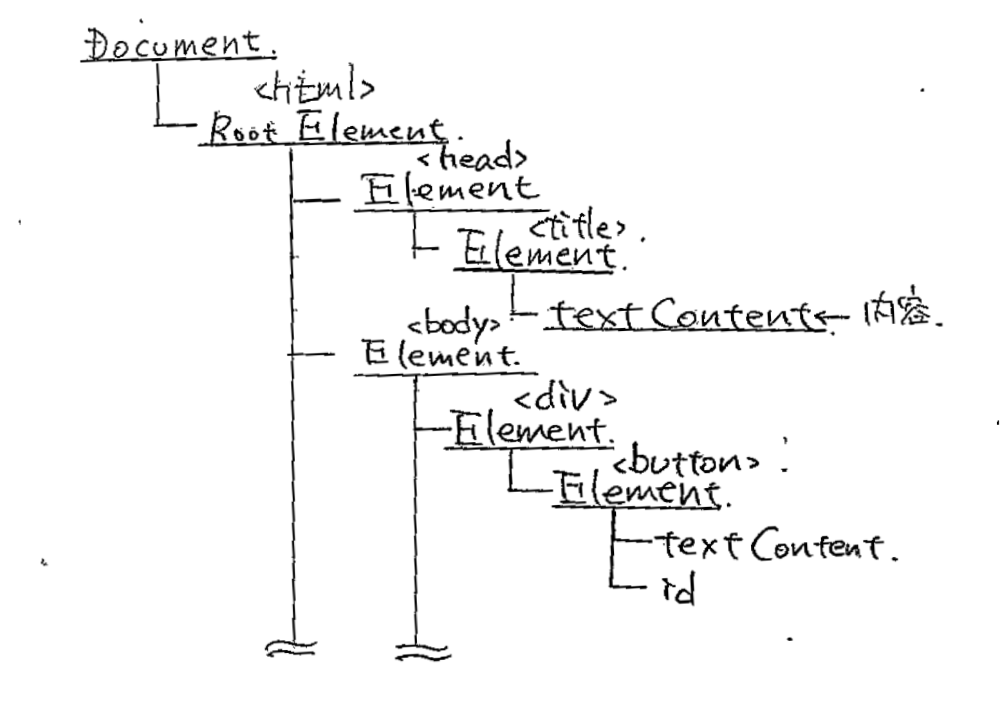

# Web APIを使う
[次にすすむ](webapi.md)
## 概要
前回まで学んできたJavaScriptを使って、いよいよ実践的な知識を学んでいきます。

## 目次
<!-- TOC -->

- [Web APIを使う](#web-apiを使う)
    - [概要](#概要)
    - [目次](#目次)
    - [Web APIを使ったHello World!](#web-apiを使ったhello-world)
        - [HTMLへの埋め込みの仕方](#htmlへの埋め込みの仕方)
        - [alert関数](#alert関数)
    - [DOM APIを使ってみる](#dom-apiを使ってみる)
    - [Documentオブジェクト](#documentオブジェクト)
        - [要素の編集](#要素の編集)
        - [要素の特定](#要素の特定)
        - [要素の追加](#要素の追加)
        - [document.createElement](#documentcreateelement)
        - [Element.appendChild](#elementappendchild)

<!-- /TOC -->

## Web APIを使ったHello World!

では早速、Web APIを使った、簡単なプログラムを見てみましょう。

- HTML

```html
<!DOCTYPE html>
<html lang="ja">
    <head>
        <meta charset="UTF-8">
        <script>
        // javascript開始
            function Hello(){
                alert("Hello World!")
            }
        </script>
    </head>
    <body>
        <a href="javascript:Hello();">
            <button type="button">実行</button>
        </a>
    </body>
</html>

```

- <a href="html/hello_world.html">実行結果</a>

<iframe src="html/hello_world.html" name="sample" width="90%" height="50">
    <a href="html/hello_world.html"></a>
</iframe>

このように、ブラウザに対して直接働きかけることができるのです。少しずつ、使いかたを見ていきましょう。

### HTMLへの埋め込みの仕方

`<script>`
タグの要素として埋め込むことで、
**上から順に**
読み込まれます。

HTML内には複数のscriptタグを入れることができます。しかし、このとき、一つ気をつけなければいけないことがあります。それは、読み込みの順です。

今後、読み込まれた直後の処理などを書いていくとき、複数のタグに分けられた状態にしておくと、

### alert関数

```js
alert("Hello World!")
```

alert関数は、引数にわたされた要素を先程確認したように、ポップアップで表示する、組み込み関数です。引数には任意の型のデータを渡すことができます。引数にはstring文字列を取ることができます。

[alert](https://developer.mozilla.org/ja/docs/XPInstall_API_Reference/Install_Object/Methods/alerts)

## DOM APIを使ってみる
では、ここから実際に要素の移動を実行していみましょう。

次のHTMLを用意します。

```html
<!DOCTYPE html>
<html lang="ja">
    <head>
        <meta charset="UTF-8">
        <script>
            function Ex(){
                document.getElementById("text").textContent = "Excuted!";
            }
        </script>
    </head>
    <body>
        <div id="text"></div>
        <a href="javascript:Ex();">
            <button type="button">実行</button>
        </a>
    </body>
</html>

```

- <a href="html/edit_text_content.html">実行結果</a>

<iframe src="html/edit_text_content.html" name="sample" width="90%" height="70">
    <a href="html/edit_text_content.html"></a>
</iframe>

## Documentオブジェクト
DOMは次のような構造を持っています。



このような、樹の内容を変化させることによって、HTMLの要素を書き変えていきます。これを操作するためのインターフェースがDocumentオブジェクトのdocument変数という形で提供されています。

これはWeb APIが提供する、組み込みオブジェクトの一つで、DOMの内容を操作するのに使うことができます。

### 要素の編集
先程の例の次の部分に注目してください。

```js
document.getElementById("text").textContent = "Excuted!";
```

- `document`<br>
これは先程説明したとおり、DOMを操作するために最初から与えられているオブジェクトです。
- `getElementById("ID")`<br>
これはDOMの中から指定したIDの要素を取り出すメソッドです。
- `textContent`<br>
これは、指定したElement(タグ)の要素の内容を示すプロパティです。ここに文字列を代入すれば、対応する要素が編集され、反映されます。また、プロパティをデータとして参照すれば、その要素の内容をそのまま取ってくることができます。

### 要素の特定

先程の
`getElementById`
のような、Elementからある要素を取得するメソッドは他にもあります。次の表を見てください。

<table>
<tr>
    <th>方式</th>
    <th>メソッド名</th>
    <th>対象</th>
</tr>
<tr>
    <td rowspan="3">種別指定</td>
    <td>
    
`getElementById`
    </td>
    <td>指定したIDの要素</td>
</tr>
<tr>
    <td>
    
`getElementsByClassName`
    </td>
    <td>指定したクラス名の全要素<br>配列を返り値として取るので注意</td>
</tr>
<tr>
    <td>
    
`getElementsByTagName`
    </td>
    <td>指定したタグの全要素<br>配列を返り値として取るので注意</td>
</tr>


<td rowspan="2">全指定</td>
    <td>
    
`querySelectorAll`
    </td>
    <td>指定した要素を全て取得<br>
    配列を返り値として取るので注意<br>
    指定はCSSセレクタ記法を用いる
    </td>
</tr>
    <td>
    
`querySelector`
    </td>
    <td>指定した要素を取得<br>同上、但し適合した最初の要素だけを抽出する</td>
</tr>
</table>

各々のメソッドは、全てElementを返り値として取るため、入れ子状の要素を順に検索することも可能です。

- 例

```html
<!DOCTYPE html>
<html lang="ja">
    <head>
        <meta charset="UTF-8">
        <script>
            function Ex(){
                let div_1 = document.getElementsByClassName("hoge")[0];
                div_1.getElementsByTagName("div")[0].textContent = "Excuted!";
            }
        </script>
    </head>
    <body>
        <div class="hoge">
            <div>
                First
            </div>
        </div>
        <div class="hoge">
            <div>
                Second
            </div>
        </div>
        <a href="javascript:Ex()">
            <button type="button">実行</button>
        </a>
    </body>
</html>

```

- <a href="html/get_element.html">実行結果</a>

<iframe src="html/get_element.html" name="sample" width="90%" height="90">
    <a href="html/get_element.html"></a>
</iframe>


### 要素の追加

これで、すでにHTML上にある要素の取得はできるようになりました。次は、まだ存在しない要素を生み出してみましょう。

```html
<!DOCTYPE html>
<html lang="ja">
    <head>
        <meta charset="UTF-8">
        <script>
            function Ex(){
                let Div = document.createElement("div");
                Div.textContent = "生成完了！";
                Div.style.textAlign = "center";

                document.body.appendChild(Div);

                return
            }
        </script>
    </head>
    <body>
        <a href="javascript:Ex()">
           <button type="button">実行</button>
        </a>
    </body>
</html>

```

- <a href="html/append.html">実行結果</a>

<iframe src="html/append.html" name="sample" width="90%" height="90">
    <a href="html/append.html"></a>
</iframe>


### document.createElement
このメソッドは、指定したタグを持つ要素をDOMに追加するものです。

### Element.appendChild
このメソッドは、指定した要素を親要素に追加するメソッドです。この操作をするまで元の要素はどこにも親要素を持たない状態の為、描画されません。

ここまでで、一通りDOMまわりの操作はできるようになりました。ここからは、DOM意外のWeb APIについて、軽くだけ学んでいきましょう。

[次にすすむ](webapi.md)
